

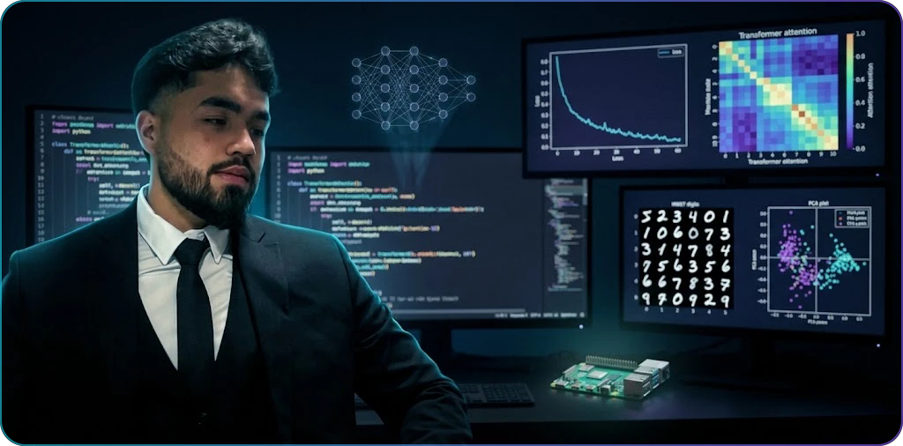


 

 

  


 


 


  




 


<a href="https://github.com/ramirezgrosas/tf2-cnn-mnist-classifier"></a>
<a href="https://github.com/ramirezgrosas/tf2-svhn-digit-recognition"></a>

<a href="https://github.com/ramirezgrosas/tf2-neural-network-validation-regularization-iris"></a>
<a href="https://github.com/ramirezgrosas/tf2-transfer-learning-eurosat"></a>

 



 

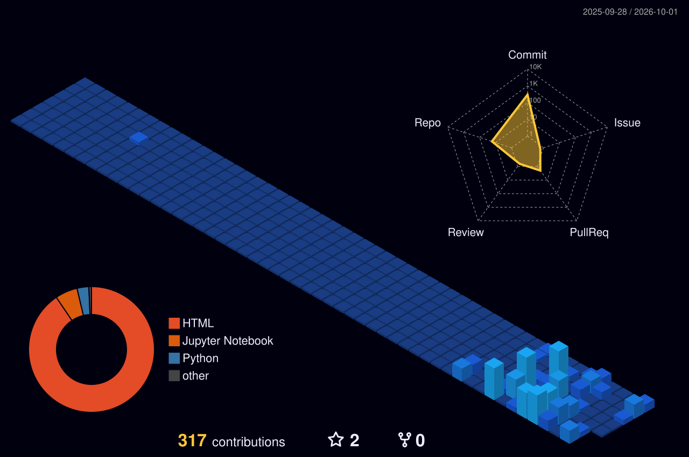

  


 


 

